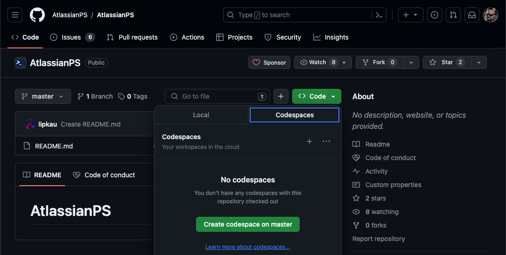

# Contributing to AtlassianPS

## Overview

This page describes:

- [Contributing to AtlassianPS](#contributing-to-atlassianps)
  - [Overview](#overview)
  - [Thank you!](#thank-you)
    - [Report anything that is not working as expected](#report-anything-that-is-not-working-as-expected)
    - [Question current methods and solutions](#question-current-methods-and-solutions)
    - [Write documentation](#write-documentation)
    - [Fix errors](#fix-errors)
    - [Contribute code](#contribute-code)
  - [How To Report An Issue](#how-to-report-an-issue)
  - [How To Submit Code Changes](#how-to-submit-code-changes)
    - [Development Container](#development-container)
      - [Working locally (in VS Code)](#working-locally-in-vs-code)
      - [Using Github Codespace](#using-github-codespace)
  - [Our Guidelines](#our-guidelines)
  - [Useful Material](#useful-material)

## Thank you!

We sincerely wish to thank you for donating your time to the AtlassianPS projects.
The quality of our projects increase with every contribution.

> One thing I can't stress enough:
> you do **not** need to be an expert coder to contribute.  
> Minor bug fixes and documentation corrections are just as valuable to the goals of the projects.  
> _All contributors, independent of the size of the contribution, are listed on our [Homepage](https://atlassianps.org/#people)._

---

There are several ways to contribute:

### Report anything that is not working as expected

It is impossible to think of every way the modules are used.

_see [submitting an issue]_

### Question current methods and solutions

It is likely that a different way to solve a problem was not considered.

_see [submitting an issue]_  
_chat with us on [AtlassianPS.Discord]_

### Write documentation

Writing useful and easy-to-read documentation is hard.  
Any help with documentation is valuable, even fixing typos.

_see [submitting code changes]_

### Fix errors

If you know how to fix a problem that you found, sending a Pull Request will simplify the process.

_see [submitting code changes]_  
_see [our guidelines]_

### Contribute code

There is _a lot_ that can be added to our projects. Any help is welcome.

_see [submitting code changes]_  
_see [our guidelines]_  
_see [investigating Atlassian APIs]_

## How To Report An Issue

When you notice something that could be improved,
tell us by creating an issue.  
GitHub makes this easy.

Each of our projects has an _Issuetracker_ where you can report your findings.

| Project                       | Link                                                                  | # of open issues                                                                                                                                                                     |
| ----------------------------- | --------------------------------------------------------------------- | ------------------------------------------------------------------------------------------------------------------------------------------------------------------------------------ |
| **AtlassianPS**               | <https://github.com/AtlassianPS/AtlassianPS/issues/new>               |                              |
| **AtlassianPS.Configuration** | <https://github.com/AtlassianPS/AtlassianPS.Configuration/issues/new> |  |
| **AtlassianPS.github.io**     | <https://github.com/AtlassianPS/AtlassianPS.github.io/issues/new>     |          |
| **BitbucketPS**               | <https://github.com/AtlassianPS/BitbucketPS/issues/new>               |                              |
| **ConfluencePS**              | <https://github.com/AtlassianPS/ConfluencePS/issues/new>              |                            |
| **HipchatPS**                 | <https://github.com/AtlassianPS/HipchatPS/issues/new>                 |                                |
| **JiraAgilePS**               | <https://github.com/AtlassianPS/JiraAgilePS/issues/new>               |                              |
| **JiraPS**                    | <https://github.com/AtlassianPS/JiraPS/issues/new>                    |                                        |

New issues are created using a template which includes pre-defined text for reporting coding exceptions.  
If your issue is not related to a coding error (e.g. you are suggesting a new feature), please modify the content to suit your needs.

**Prior to creating a new issue, please search the issues to determine if a similar issue has already been created.**  
**If one has, add any relevant comments to the issue's discussion.**

## How To Submit Code Changes

No matter if you are fixing a typo or if you wrote a fully-functioning feature for a project:  
**You will have to send your code to `AtlassianPS`**

> The possibilities of what our projects can do is ever growing (as Atlassian also makes changes to the API).
> Therefore it is very unlikely for our project to ever be _feature complete_.  
> The only chance we have to keep up with the changes, is by having as many people involved as possible.
> We appreciate the help 😊

This makes sense, as it would be impossible to manage user permissions in all of the project for all of the users.
Therefore, everyone who want to make changes to the code must make a copy of the repository into his GitHub account (aka [forking](https://help.github.com/articles/fork-a-repo/)).

With a copy of the code in a location where you are allowed to make changes to, you get to work.

When you are finished, you will send your changes to the original project (aka [Pull Request](https://help.github.com/articles/about-pull-requests/)).
It will be reviewed and, when approved, merged.

There is a bit more to take into account when submitting code to the projects.
You can read all about it here: **[Submitting A PR]**.

### Development Container

Our repository includes a ["Dev Container"](https://containers.dev/) / GitHub Codespaces development container.

> **What are Development Containers?**  
> A development container (or dev container for short) allows you to use
> a container as a full-featured development environment.
> It can be used to run an application, to separate tools, libraries,
> or runtimes needed for working with a codebase,
> and to aid in continuous integration and testing.

You can use the devcontainer to spin up a fine tuned development environment with
everything you need for working on AtlassianPS projects.

You can use the devcontainer in your favorite edit or github codespace.

#### Working locally (in VS Code)

You can use the bellow links to get started.
The links will trigger VS Code to automatically install the Dev Containers extension if needed,
clone the source code into a container volume, and spin up a dev container for use.

- [AtlassianPS](https://vscode.dev/redirect?url=vscode://ms-vscode-remote.remote-containers/cloneInVolume?url=https://github.com/atlassianps/atlassianps)
- [AtlassianPS.Configuration](https://vscode.dev/redirect?url=vscode://ms-vscode-remote.remote-containers/cloneInVolume?url=https://github.com/atlassianps/atlassianps.configuration)
- [AtlassianPS.github.io](https://vscode.dev/redirect?url=vscode://ms-vscode-remote.remote-containers/cloneInVolume?url=https://github.com/atlassianps/atlassianps.github.io)
- [BitbucketPS](https://vscode.dev/redirect?url=vscode://ms-vscode-remote.remote-containers/cloneInVolume?url=https://github.com/atlassianps/bitbucketps)
- [ConfluencePS](https://vscode.dev/redirect?url=vscode://ms-vscode-remote.remote-containers/cloneInVolume?url=https://github.com/atlassianps/confluenceps)
- [JiraAgilePS](https://vscode.dev/redirect?url=vscode://ms-vscode-remote.remote-containers/cloneInVolume?url=https://github.com/atlassianps/jiraagileps)
- [JiraPS](https://vscode.dev/redirect?url=vscode://ms-vscode-remote.remote-containers/cloneInVolume?url=https://github.com/atlassianps/jiraps)

#### Using Github Codespace

Github allows you to spin up a virtual editor ("VS Code in your browser").
You can create your own codespace by navigating to <https://github.com/codespaces>
or by using the "Code" button in the repository itself, as shown bellow.

## Our Guidelines

We strive for making the process of contributing as easy as possible.
However, having good documentation, follow some best practices and keeping the code aligned is crucial for a high quality of the projects.

When contributing to the code, please follow [Our Guidelines](our-guidelines.html).

## Useful Material

- GitHub's guide on [Contributing to Open Source](https://guides.github.com/activities/contributing-to-open-source/#pull-request)
- [GitHub Flow Guide](https://guides.github.com/introduction/flow/): step-by-step instructions of GitHub flow.

<!-- reference-style links -->
  [AtlassianPS.Discord]: https://atlassianps.org/contact/
  [submitting an issue]: #how-to-report-an-issue
  [submitting code changes]: #how-to-submit-code-changes
  [our guidelines]: #our-guidelines
  [investigating Atlassian APIs]: #todo
  [Submitting A PR]: submitting-a-pr.html
