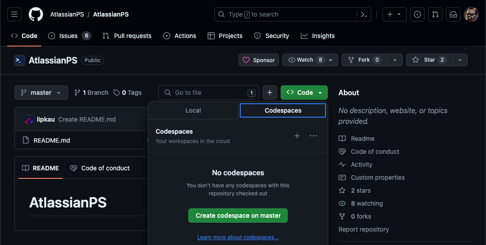

# Contributing to AtlassianPS

Thank you for helping improve AtlassianPS.

You do **not** need to be an expert to contribute. Small fixes, typo corrections, and docs improvements are all valuable.
Every contribution matters, and we are glad you are here.

## Start here

- Want to report a problem or suggest an idea? See [How To Report An Issue](#how-to-report-an-issue).
- Want to submit changes? See [How To Submit Code Changes](#how-to-submit-code-changes).
- Want coding standards? Read [Our Guidelines](our-guidelines.html).

## Common ways to contribute

- Report bugs or unclear behavior.
- Improve documentation.
- Fix defects you can reproduce.
- Add small quality-of-life enhancements.
- Contribute larger features.

## How To Report An Issue

When you notice something that could be improved, tell us by creating an issue.

Each of our projects has an _issue tracker_ where you can report your findings.

| Project                       | Link                                                                  | # of open issues                                                                                                                                                                     |
| ----------------------------- | --------------------------------------------------------------------- | ------------------------------------------------------------------------------------------------------------------------------------------------------------------------------------ |
| **AtlassianPS**               | <https://github.com/AtlassianPS/AtlassianPS/issues/new>               |                              |
| **AtlassianPS.Configuration** | <https://github.com/AtlassianPS/AtlassianPS.Configuration/issues/new> |  |
| **AtlassianPS.github.io**     | <https://github.com/AtlassianPS/AtlassianPS.github.io/issues/new>     |          |
| **BitbucketPS**               | <https://github.com/AtlassianPS/BitbucketPS/issues/new>               |                              |
| **ConfluencePS**              | <https://github.com/AtlassianPS/ConfluencePS/issues/new>              |                            |
| **HipchatPS**                 | <https://github.com/AtlassianPS/HipchatPS/issues/new>                 |                                  |
| **JiraAgilePS**               | <https://github.com/AtlassianPS/JiraAgilePS/issues/new>               |                              |
| **JiraPS**                    | <https://github.com/AtlassianPS/JiraPS/issues/new>                    |                                        |

Before creating a new issue, please search open issues first.
If a similar issue already exists, add your details there.

## How To Submit Code Changes

No matter if you are fixing a typo or shipping a new feature, changes are submitted through a Pull Request.

Start with **[Submitting A PR](submitting-a-pr.html)** for the full flow.

### Development Container

Our repository includes a ["Dev Container"](https://containers.dev/) / GitHub Codespaces development container.

> **What are Development Containers?**  
> A development container (or dev container for short) allows you to use
> a container as a full-featured development environment.
> It can be used to run an application, to separate tools, libraries,
> or runtimes needed for working with a codebase,
> and to aid in continuous integration and testing.

You can use the devcontainer to spin up a fine-tuned development environment with
everything you need for working on AtlassianPS projects.

You can use the devcontainer in your favorite editor or GitHub Codespace.

#### Working locally (in VS Code)

You can use the links below to get started.
The links will trigger VS Code to automatically install the Dev Containers extension if needed,
clone the source code into a container volume, and spin up a dev container for use.

- [AtlassianPS](https://vscode.dev/redirect?url=vscode://ms-vscode-remote.remote-containers/cloneInVolume?url=https://github.com/atlassianps/atlassianps)
- [AtlassianPS.Configuration](https://vscode.dev/redirect?url=vscode://ms-vscode-remote.remote-containers/cloneInVolume?url=https://github.com/atlassianps/atlassianps.configuration)
- [AtlassianPS.github.io](https://vscode.dev/redirect?url=vscode://ms-vscode-remote.remote-containers/cloneInVolume?url=https://github.com/atlassianps/atlassianps.github.io)
- [BitbucketPS](https://vscode.dev/redirect?url=vscode://ms-vscode-remote.remote-containers/cloneInVolume?url=https://github.com/atlassianps/bitbucketps)
- [ConfluencePS](https://vscode.dev/redirect?url=vscode://ms-vscode-remote.remote-containers/cloneInVolume?url=https://github.com/atlassianps/confluenceps)
- [JiraAgilePS](https://vscode.dev/redirect?url=vscode://ms-vscode-remote.remote-containers/cloneInVolume?url=https://github.com/atlassianps/jiraagileps)
- [JiraPS](https://vscode.dev/redirect?url=vscode://ms-vscode-remote.remote-containers/cloneInVolume?url=https://github.com/atlassianps/jiraps)

#### Using GitHub Codespace

GitHub allows you to spin up a virtual editor ("VS Code in your browser").
You can create your own codespace by navigating to <https://github.com/codespaces>
or by using the "Code" button in the repository itself, as shown below.

## Our Guidelines

Please follow [Our Guidelines](our-guidelines.html) when contributing code or docs.

## Useful Material

- GitHub's guide on [Contributing to Open Source](https://guides.github.com/activities/contributing-to-open-source/#pull-request)
- [GitHub Flow Guide](https://guides.github.com/introduction/flow/): step-by-step instructions of GitHub flow.

<!-- reference-style links -->
  [AtlassianPS.Discord]: https://atlassianps.org/contact/
