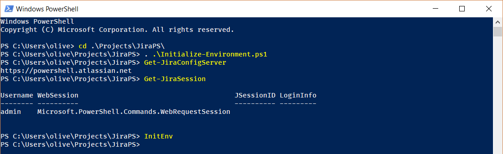

### Description

This script will:

* install [BetterCredentials](https://github.com/Jaykul/BetterCredentials)
* install JiraPS
* import JiraPS into runtime
* load credentials
* authenticate with JIRA server

### Code


