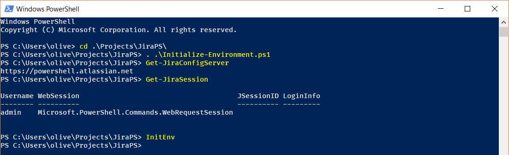

### Description

This script will:

* Install [BetterCredentials](https://github.com/Jaykul/BetterCredentials)
* Install JiraPS
* Import JiraPS into runtime
* Load credentials
* Authenticate with JIRA server

### Code


