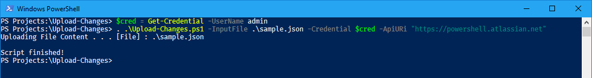

## Description

This script takes a Json file as input and updates all Issues in it.

I have a colleague at work who writes HTML apps for managing due dates and sprint assignment of issues.  
He was unable to figure out how to upload the data back into Jira, as the server does not allow for CORS ajax requests.

So my workaround is: his HTML app dumps the results to JSON - and a scheduled job runs the following script that persists the changes to the issues on Jira.

## Code


